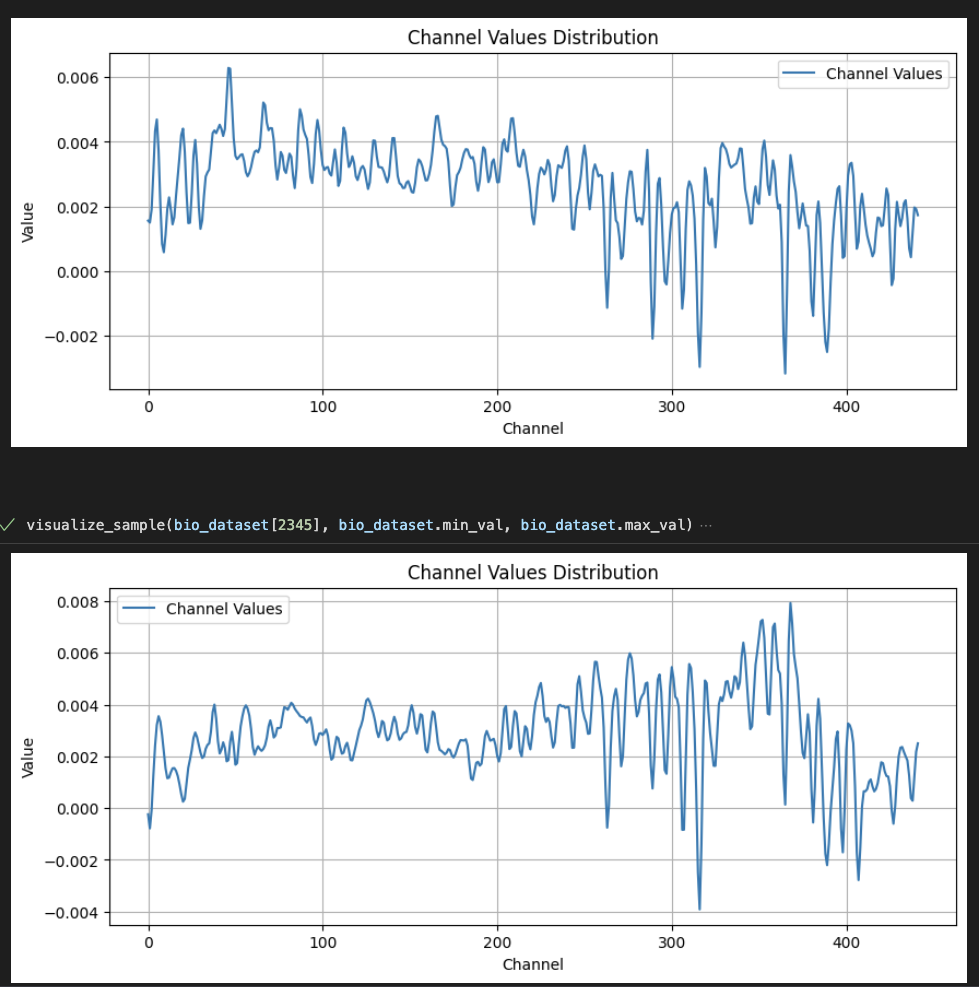

# Variational Autoencoder
- Goal: adaptation to make the basic VAE from [this tutorial](https://medium.com/@rekalantar/variational-auto-encoder-vae-pytorch-tutorial-dce2d2fe0f5f) work on our dataset

## implementation docs

### Training examples
- using all channels per pixel value as single example. If I plot them as a line chart I get this:
- 

### caling of the data
Scaling is done in the dataset class upon loading the data. The min max values of the entire dataset are used and stored for scaling. This should maybe be changed to the real theoretical min and max values of the dataset. The scaling is done as follows:

1. **Compute Min and Max Values**: Find the minimum and maximum values across your entire dataset.

2. **Scale the Data**: Apply the min-max normalization formula to scale each value to the range [0, 1]. The formula is: Scaled value = $\frac{{value - min\_value}}{{max\_value - min_value}}$

3. **Apply Scaling in the Dataset Class**: You can integrate this scaling directly into your custom dataset class.

## Research:
- [what is a VAE?](https://jaan.io/what-is-variational-autoencoder-vae-tutorial/)
- [explanation of VAEs](https://towardsdatascience.com/understanding-variational-autoencoders-vaes-f70510919f73)

### Promising links:
- https://github.com/AntixK/PyTorch-VAE