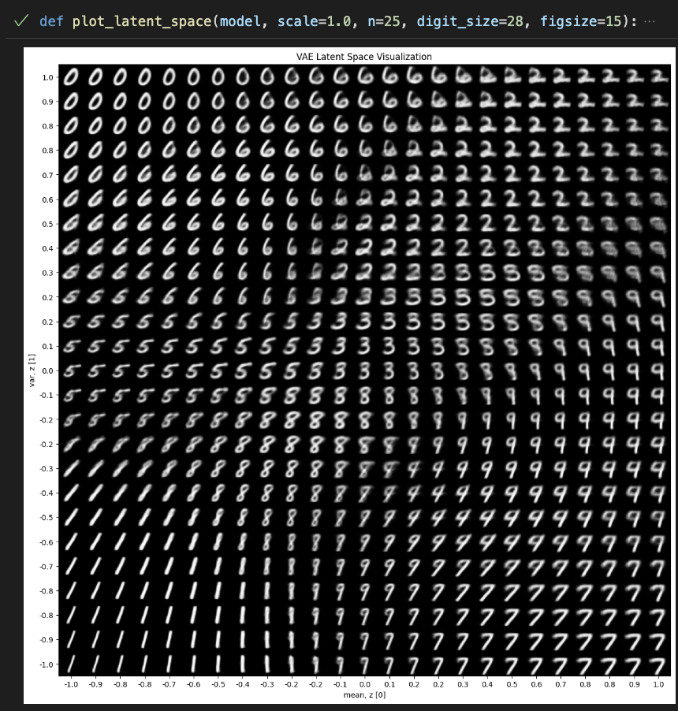

# Variational Autoencoder
- First implementation based on [this tutorial](https://medium.com/@rekalantar/variational-auto-encoder-vae-pytorch-tutorial-dce2d2fe0f5f)
- I trained the variational autoencoder on the MNIST dataset for 50 epochs locally and was able to replicate the results from the tutorial:
  - Epoch 50 	Average Loss:  133.10832231779528
  - Overall loss: 7973188.5068359375
  - My latent space visualizatio:
    

### Promising links:
- https://github.com/AntixK/PyTorch-VAE