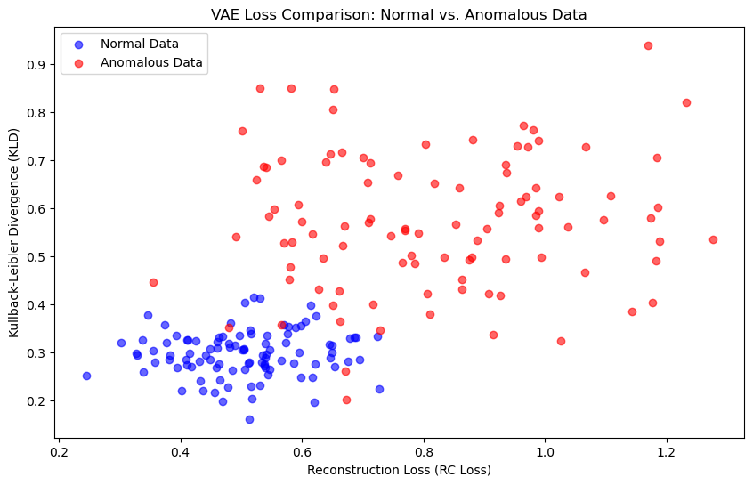
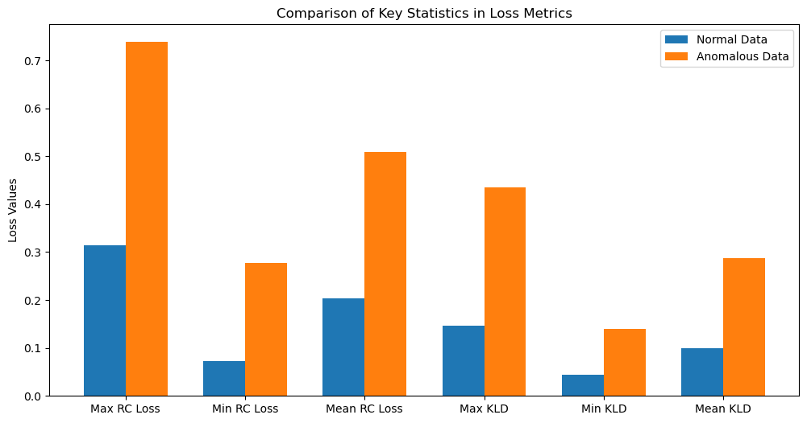

## Next step:
- [x] Validate that the approach is correct
- [x] Train on server with all data for 50 epochs
- Feedback from 6.12.2023
  - track reconstruction loss & KBL seperately
    - Use KBL for training progress tracking
  - train on /prodi/hpcmem/spots_ftir_corr/ for comparison
  - look into beta-vae für gewichtung der loss terms
  - In current architecture: Add layers to the VAE
  - Normalize per pixel in get item and always take the same index for the max and min
  - Test on corrected and uncorrected data
- Todos planned 9.12:
  - [x] Find index of max and min value and hardcode them in getitem (for normalization)
  - [x] Separate the reconstruction loss and the Kulback-Leibler divergence loss into two different losses
  - [x] Use combined loss for optimization
  - [x] Implement using a validation set for validation after each epoch
  - [x] Use the KBL of the validation set for early stopping
  - [x] Run experiments on uncorrected data
  - [x] Run same experiments on corrected data
  - [ ] Compare results - how? What is a good test to determin which autoencoder is better?

## Current Problems:
- Training with fixed indices for normalization is not working:
  - I cant use cross entropy loss with fixed indices for normalization since the input and target have to be between 0 and 1
  - When I use MSE or MAE loss, the loss becomes always nan

## Feedback / Todos 21.12: 
- Fix normalization: increase constant 
- If normalization works train mostly on corrected data (but test both)
- Result plotting: use z for dimensionality reduction: TSNE, PCA and plot this
- Run experiments if training works, produce plots for all experiments

## Proposal further development:

#### Model Training
- **Variational Autoencoders (VAEs)**: Train multiple VAEs with varying configurations.
- **Configurations**: Experiment with different numbers of layers and varying sizes/narrowing within the layers.

#### Data Split and Training Process
- **Data Split**: Utilize a 90/10 train-validation split on a large dataset.
- **Training Duration**: Train each VAE for up to 100 epochs, with early stopping based on validation loss (typically around epoch 50).
- **Loss Monitoring**: Track and plot reconstruction (RC) loss and Kullback-Leibler Divergence (KLD) separately during training for insight into model behavior.

#### Model Evaluation
- **Test Data**: Use a small, balanced subset of normal and anomalous data for evaluation.
- **Loss Comparison**:
  - Plot RC loss and KLD against each other for both normal and anomalous samples.
  - Highlight key statistics: absolute maximum, minimum, and mean of both RC loss and KLD, comparing normal versus anomalous instances.

#### Plot proposal:
- Scatter plot of RC loss vs. KLD, comparing normal versus anomalous instances.
- 
- key statistics: absolute maximum, minimum, and mean of both RC loss and KLD, comparing normal versus anomalous instances.
- 

#### Selection Criteria for Optimal Model
- Choose the VAE model that maximizes the difference in loss metrics (both RC and KLD) between normal and anomalous data, ensuring effective anomaly detection.

#### Expected Outcome
- Identification of the VAE configuration that best distinguishes between normal and anomalous pixels, leveraging the unique properties of VAEs in capturing data distributions.